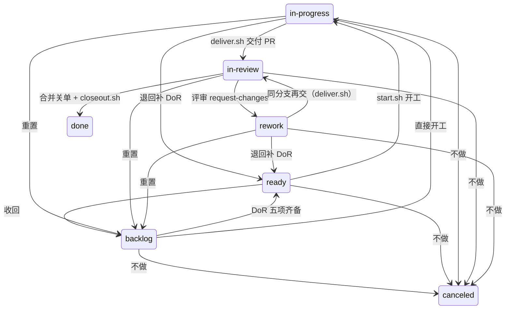
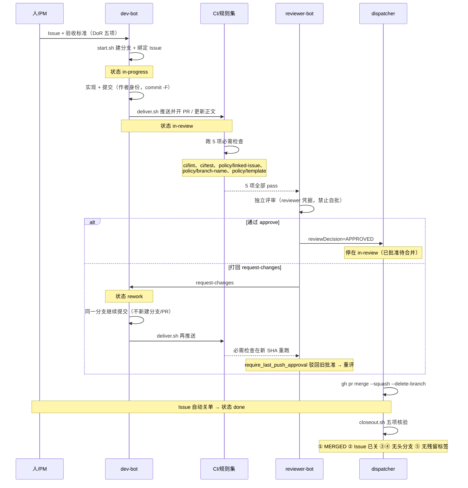

# WORKFLOW — 多 agent + GitHub 开发工作流

> [README](../README.md) 讲本质，[AGENTS.md](../AGENTS.md) 讲契约，本文件讲**步骤与判据**。
> 冲突时：**GitHub 平台实际行为 > 本文件 > AGENTS.md**。发现冲突开 Issue 改文档，而不是按"更方便"执行。

## 0. 三身份

| 角色 | 账号 | 凭据 | 职责 |
|---|---|---|---|
| 作者 | `@yes8080-dev-bot` | `.secrets/developer.pat`（`repo, workflow`） | 建分支、提交、推送、开 PR、返修 |
| 评审 | `@yes8080-reviewer-bot` | `.secrets/reviewer.pat`（`repo`） | `approve` / `request-changes`（不得合并） |
| 合并 | `@yes8080` | 本机 `gh auth login` 登录态 | 合并、改仓库设置、跑 `closeout.sh` |

身份由**平台**强制：GitHub 禁止自我批准。作者凭据缺 `workflow` scope 时推送 `.github/workflows/**` 会被服务端
整体拒绝；评审凭据失效 = `.github/**`、`scripts/**`、`docs/**` 永久无法合并（`require_code_owner_review`）。两者都由 `preflight.sh`（W0）拦截。

## 1. 状态机（唯一源）

> 状态 = `status/*` 标签 + Issue 开关；**没有本地状态文件**。迁移只能走 `scripts/status.sh <issue#> <state>`。
> 状态集 **7 个**：`backlog | ready | in-progress | in-review | rework | done | canceled`；`in-review` = 「评审中 / 已批准待合并」（没有单独的「验收」状态，批准本身就是验收门禁）。

### 状态机图（7 个状态、18 条边）

`done` / `canceled` 无出边。**转换表是强制的**：表外 `from → to` → `status.sh` 失败（退出码 1）；唯一兜底是显式
`--force`（跳过表校验 + 打印 `[WARN]` 与被绕过的边，互斥与迁移后校验仍执行）。需要 `--force` 就说明流程走错了，或该开 Issue 补一条边。

### 转换表（唯一权威；与 `scripts/status.sh` 的 `TRANSITIONS` 由 `ci/test` 断言**逐字一致**）

<!-- TRANSITIONS:BEGIN（机器可读；与 scripts/status.sh 的 TRANSITIONS 逐字一致，由 ci/test 断言） -->

| from | to（合法出边） |
|---|---|
`backlog` | `ready` `in-progress` `canceled`
`ready` | `in-progress` `backlog` `canceled`
`in-progress` | `in-review` `ready` `backlog` `canceled`
`in-review` | `rework` `done` `backlog` `canceled`
`rework` | `in-review` `ready` `backlog` `canceled`
`done` | （终态；无出边）
`canceled` | （终态；无出边）

<!-- TRANSITIONS:END -->

### 状态载体

`done` / `canceled` 有两个载体：Issue `CLOSED` **且**无任何 `status/*` 标签。

| 状态 | 载体 |
|---|---|
| backlog | 无 `status/*` 标签 + Issue OPEN |
| ready | `status/ready` |
| in-progress | `status/in-progress` |
| in-review | `status/in-review` |
| rework | `status/rework` |
| done | Issue CLOSED（`state_reason=completed`） |
| canceled | Issue CLOSED（`state_reason=not planned`） |

体检：`scripts/status.sh --check` 扫全部开放 Issue，每个必须 0 或 1 个 `status/*`（0 = backlog）；`ci/test` 每次 PR 也跑同一不变量。

**只读预检（副作用之前）**：`scripts/status.sh --check-transition <from> <to>` 只判定迁移合法性，
**零副作用**（不读网络/凭据，不写任何东西；退出码 0 合法 / 1 非法 / 2 用法错）。非法时打印该
`from` 的合法出边与对应命令。`start.sh`（建分支前）与 `deliver.sh`（推送/建 PR 前）**先读当前
状态、再调用它**：非法就立即失败，不留半成品。`start.sh` 不再假定 Issue 在 `backlog`。

### 交叉体检（只读，Issue ↔ PR）— `scripts/status.sh --check-cross`

`--check`、`ci/test`、`policy/*` **都只读 Issue**，所以「Issue 已 in-review 而关联 PR 被关闭」
这类不一致曾经没有任何门禁能看到。本命令同时读 Issue 与 PR、**零副作用**（只发 GET、只写临时目录）：

| 规则 | 判据 |
|---|---|
| R1 | Issue 为 `in-review`，但关联 PR 已 `CLOSED`（未合并） |
| R2 | Issue 为 `done`，但关联 PR 未合并（仍开放 / 已关闭未合并） |
| R3 | Issue 为 `in-review`，但**没有任何开放 PR** |
| R4 | 有开放 PR，但 Issue 无任何 `status/*`（Backlog） |

「关联」只认两种**可判定**证据：PR 的 `closingIssuesReferences`（GitHub 解析出的关闭关系）或
分支名 `<type>/<issue#>-<slug>`。两者都没有的 PR **不得猜测** —— 如实标注为「无法判定」并列出，
不计入冲突。退出码 0 = 四条规则全未命中；1 = 存在冲突（逐条打印规则、Issue/PR 号与关联方式）。

## 2. W0..W7 闭环

### 时序图（谁在什么时候触发）

### W0 预检（每次接手都跑）— `scripts/preflight.sh`

全部 `[ OK ]` 才继续；任何 `[FAIL]` → 把原文报告 dispatcher，**不要"先干着看"**。它检查：命令齐备 / gh 登录 / cwd 在仓库内且非 worktree / 工作区状态 / 远端唯一 origin / 三身份凭据可用且**两两不同** / 作者凭据含 `workflow` scope / 凭据未入库且权限 600 / 线上规则集与 `.github/rulesets/main-protection.json` 的必需 context 一致 / 每个必需 context 都有工作流 job。

### W1 领片（DoR）— `gh issue list --state open --label status/ready --limit 20 --json number,title,labels`

五项全齐才可从 backlog → `ready`：① 价值一句话 ② 可判定的验收标准 ③ 明确不改什么（边界）④ 依赖与契约 ⑤ 规模与执行者。

### W2 开工 — `scripts/start.sh <issue#> --as author`

**先做只读状态预检**（读平台的当前状态 → `status.sh --check-transition <cur> in-progress`）；
非法（例如 Issue 停在 `in-review`）→ **在创建分支之前**失败，绝不留下半成品。
然后：校验 Issue OPEN 且无未关闭阻塞 → `gh issue develop` 建分支并**绑定** Issue → 指派给作者 → 留开工声明 → `in-progress`。
分支名 `<type>/<issue#>-<slug>`，`type ∈ {slice,fix,hotfix,spike,chore}`，slug 只允许 `[a-z0-9-]`；`policy/branch-name` 会**逐字**校验这条正则，并要求 Issue OPEN 且已有 `status/*` 标签。

### W3 实现与提交

`bash -n scripts/*.sh`；提交：`git -c user.name="yes8080-dev-bot" -c user.email="317173623+yes8080-dev-bot@users.noreply.github.com" commit -F /tmp/msg.txt`
提交者身份必须**显式**指定（`--as author` 只切 `gh` 的 API 身份，不改 git 身份）；提交信息用 `-F <文件>`（带反引号/多行的信息内联进命令行会被 shell 吃掉）；收尾前工作区必须干净（`deliver.sh` 会拦）。

### W4 交付 PR — `scripts/deliver.sh <issue#> --prepare --as author` → `scripts/deliver.sh <issue#> --as author`

门禁（本地预演，与 `policy/*` 同一套）：**先做只读状态预检**（`--check-transition <cur> in-review`，
非法则在**推送之前**失败，不写骨架、不推送、不建 PR）／正文含 `Closes #N`（**标题里的关键字无效**）／含 `## 1.` … `## 6.` 六段且每段有实质内容／分支名合规且分支里的 issue 号 = 传入的 issue 号。该分支**已有** PR（返修场景）时只推送并改用 REST PATCH 更新正文（§已知陷阱 7）。

### W5 必需检查（5 个，逐字）— `gh pr checks <pr#> --required`

| context（= job `name:`） | 判什么 |
|---|---|
| `ci/lint` | 被跟踪脚本的 `bash -n` + bash 3.2 兼容（禁 bash4 特性、`$VAR` 后不得紧跟中文）+ JSON 有效 |
| `ci/test` | 关键不变量：5 个 context 与工作流 job 名**精确相等**、规则集形状、状态标签互斥、PR 模板六段、无凭据入库、脚本自包含、docs↔status.sh 转换表逐字一致 |
| `policy/linked-issue` | 正文有 `Closes #N` **且** GitHub 解析出了关闭关系（目标必须是默认分支） |
| `policy/branch-name` | 分支名匹配正则 + Issue OPEN + 已有 `status/*` 标签 |
| `policy/template` | 正文有 `## 1.` … `## 6.` |

全部 `pass` 才能进 W6；某项永久 `pending` → §已知陷阱 1、2。

### W6 独立评审 — `scripts/review.sh <pr#> approve --body-file review.md`（或 `request-changes`）

必须由 `@yes8080-reviewer-bot` 发（`review.sh` 用评审凭据，**不加** `--as`）。评审通过 → **不迁移状态**（停在 `in-review`）；打回 → `rework`（在**同一分支**继续提交，不新建分支/PR）。`require_last_push_approval`：返修后新推送会**驳回旧批准**，必须重新评审。

### W7 合并与收尾（dispatcher）

`gh pr merge <pr#> --squash --delete-branch`（只有 `@yes8080` 能做）→ `scripts/closeout.sh <pr#>` 五项：① PR 已 MERGED ② 关联 Issue 已关 ③ 远端无头分支 ④ 本地无头分支已清理 ⑤ 无残留状态标签。
第 ⑤ 项**由 `closeout.sh` 自己清理**（内部调用 `status.sh <n> done`，仅对已关闭的 Issue；OPEN 的 Issue 绝不代关，否则掩盖「合并没关单」）。第 ④ 项**先**把「分支名 + 本地 tip SHA + PR head SHA + squash 提交」写进 Issue 作为可恢复锚点，**再** `git branch -D`（squash 后原始提交不在 `main` 上，`-d` 必然拒绝；但绝不允许无条件 `-D`）。

### W8 终止/取消（异常路径出口）— `scripts/abort.sh <issue#>`

W0..W7 只覆盖「一路顺风」。`canceled` 是**既有终态**（无出边、不新造状态），但此前它**没有步骤、
没有执行者、没有判据**，分支实体在异常路径上也没有清理者 —— #60 的孤儿分支就是后果（Issue 已
`canceled`，远端分支仍留着，**无 PR、无任何门禁能看到**，直到一次独立审查才发现）。

| 项 | 规定 |
|---|---|
| 谁可发起 | 作者（PR 关闭不合并 / 中途放弃）或 PM·dispatcher（决定不做）；发起时在 Issue 留一句原因 |
| 谁确认 | dispatcher（`@yes8080`）确认「确实不做」；清理动作由**作者身份**执行（`--as author`，分支属作者），但状态迁移只走 `status.sh` |
| 判据（全部成立才终止） | ① 不再计划完成（不做 / 被替代 / 放弃）② 删除分支**不会丢内容**（见下方判据） |
| 必须同时做 | 清理**本地 + 远端**分支；状态 → `canceled`（**只走 `scripts/status.sh`**，绝不直接改标签）；在 Issue 留**可恢复锚点**（分支 tip SHA / 原因 / 时间 / 判据） |

三条异常路径共用同一命令（脚本按平台事实自动识别路径，并写进锚点）：

| 路径 | 触发事实 | 命令 |
|---|---|---|
| ① PR 关闭不合并 | PR 为 `CLOSED` 且未 MERGED | `scripts/abort.sh <issue#>` |
| ② 作者中途放弃 | 有分支，可能从未有 PR | `scripts/abort.sh <issue#>` |
| ③ Issue 已取消但分支已建 | Issue `CLOSED(not planned)` + 分支残留 | `scripts/abort.sh <issue#>` |

**删除判据（fail-closed，不得无脑强删）**：只有能证明「内容不会丢」才删 —— ① 分支 tip（本地与远端
都算）是 `origin/main` 的**祖先**，或 ② 该分支有**已合并** PR（squash 后 tip 不在 `main` 上，但内容
已合入），或 ③ 显式 `--evidence "<说明>"`（人工声明内容已另有归宿，声明**原文**写进锚点；**没有**
无记录强删的开关）。三条都不成立（存在独有未合并提交）→ **一个分支都不删、状态也不迁移**，打印
分支 tip、独有提交与处置选项后退出 1。可恢复锚点写不进去同样不删。**幂等**：连跑两次，第二次
不产生任何写操作。`done` 是终态且属合并收尾 → 走 `closeout.sh`，`abort.sh` 拒绝处理（除分支外的
内容会丢，需先 `gh issue reopen`）。

## 3. DoD（什么算做完）

- [ ] Issue 的验收标准**逐条**有可核对证据（命令 + 输出 / 检查名 / 运行链接）
- [ ] 5 个必需检查在该 PR 的**最新 SHA** 上全部通过
- [ ] 至少 1 名非作者 code owner 批准（`reviewDecision=APPROVED`）
- [ ] PR 正文六段齐备，第 3 节回滚方式**可执行**
- [ ] 未越界：只改了 Issue「边界」内的内容
- [ ] `closeout.sh` 五项全过（合并后由 dispatcher 跑）
- [ ] 新增的坑已写进本文件 §已知陷阱

## 4. 已知陷阱（均有原始证据，别再踩）

1. **必需检查不能"先失败后通过"。** 一旦某个必需 check 在某个 SHA 上留下 `FAILURE`，**后续同名检查通过也无法解除阻塞**（实测：`reviewDecision=APPROVED` + 全部 checks 最新一次 success，仍 `BLOCKED`）。→ 验收门禁只用**原生规则**（`required_approving_review_count: 1` + `require_last_push_approval` + `dismiss_stale_reviews_on_push`）。
2. **必需检查的 context = 工作流里 job 的 `name:`**，不是文件名、不是 workflow `name:`。改 `name:` = 所有 PR 永久 pending。也不要给必需检查工作流加 `paths`/`branches` 过滤（被跳过的工作流 = 检查永久 pending），更不要用 `issue_comment` 触发（官方只认 `push`/`pull_request`/`pull_request_review`/`pull_request_target`/`deployment`/`deployment_status`）。
3. **`merge_group` 未接线。** 本仓库私有且非 GHEC，Merge Queue 不可用，故 5 个 job 只监听 `pull_request`。若将来启用 Merge Queue，**必须**同时给 5 个 job 接上 `merge_group`，否则合并队列会因必需检查未上报而永久卡住。
4. **规则集目标只能用 `~DEFAULT_BRANCH`，不得用 `**`。** 写通配符会导致切片分支合并后删不掉。
5. **`git push --dry-run` 不能用来判断规则集是否生效**（dry-run 不评估 repository rules）。真正阻止直推 `main` 的是 `pull_request` 规则（原文：`push declined due to repository rule violations`）。
6. **CODEOWNERS 里任何会被改动的路径都必须至少有一个"非作者" owner。** 若某路径 owner 只有作者本人而 `require_code_owner_review=true`，该路径的改动**永久无法合并**。且 CODEOWNERS **取自目标分支** —— 在 PR 里改它无法为该 PR 自己解锁。
7. **作者的 classic PAT 只有 `repo` + `workflow`，没有 `read:org`。** `gh pr edit` 走 GraphQL、需要 `read:org` → 报 `Your token has not been granted the required scopes ... 'read:org'` 且**静默不更新正文**。改 PR 正文必须用 REST：`jq -Rs '{body:.}' file | gh api -X PATCH repos/$REPO/pulls/$N --input -`，并在写后**回读校验**（`deliver.sh` 已封装）。
8. **推送必须清掉本地 credential helper**：`git -c credential.helper= -c credential.helper='!gh auth git-credential' push -u origin <branch>` —— 否则 macOS 钥匙串里缓存的主身份凭据会优先命中，"作者身份推送"会静默变成主身份推送。
9. **macOS 自带 bash 是 3.2。** 禁 `mapfile`/`readarray`/`declare -A`/`${var,,}`；`$VAR` 后紧跟中文等多字节字符必须写 `${VAR}`，否则字节序列被并入变量名 → `unbound variable`。`sed` 是 BSD 版：扩展正则要用 `sed -E`。
10. **`blockedBy` 不会因对方关闭而自动清除。** 判定"是否真被阻塞"必须看 blocker 的 `state`。
11. **squash 合并后 `git branch -d` 必然拒绝**（原始提交不在 `main` 上）。先验证 PR=MERGED，留锚点，再 `-D`；绝不无条件 `-D`。
12. **流程只在仓库里。** `docs/WORKFLOW.md` + `AGENTS.md` + `.github/**` + `scripts/**` 就是全部权威流程描述；不引入第二套规范文档，也不发布"可移植治理套件"。元工具自身的代码量超过它服务的开发工作，就是失控信号。
13. **规则集声明必须与线上「整份」一致，不是"挑几个字段"。** `.github/rulesets/main-protection.json` 的比对是**全量键 diff**：唯一判据是 `RULESET_CANON_JQ`（同一段文本同时出现在 `scripts/preflight.sh` 与 `ci/test`，由 `ci/test` 断言逐字一致）。挑字段比对曾让线上多出的 `require_extra_approval_for_unattributed_changes: true` / `required_reviewers: []` 静默漂移很久。语义：`require_extra_approval_for_unattributed_changes` = 含**无法归属到 GitHub 身份**的提交时需**额外批准**（本项目历史提交的作者邮箱 `wsmsn@msn.com`/`10019@outlook.com` 不可归属 → 这类 PR **可能要求多于 1 个批准**）。改这个文件属 dispatcher 权限；改键集时 `ci/test` 的全量键清单要同步改（有意的摩擦）。
14. **状态迁移不是原子的（`status.sh` 先 remove 再 add），中间有「零 `status/*` 标签」窗口。** `deliver.sh` 的次序是「推送 → 建 PR → 迁 `in-review`」，而 PR 事件会**立刻**触发必需检查 —— `policy/branch-name` 若在窗口内读标签，会把 Issue 判成 Backlog 并**在该 SHA 上失败**（实测 PR #92 首 SHA `cc9cf14`：`2026-10-04T14:06:13Z` unlabeled → `14:06:16Z` labeled，检查在 `14:06:14.84Z` 读）。临时缓解：**重跑失败的 `policy/branch-name`**（同一 SHA 实测重跑后 5 项全 pass）。根治见 Issue #93。
15. **脚本里用 tab 当字段分隔符会静默吞掉空字段。** `IFS="$(printf '\t')" read -r a b c` 遇到连续 tab（中间字段为空）时后面的字段会**左移** —— tab 属于 IFS 空白，连续空白只算一个分隔符。`--check-cross` 的早期实现因此在「按行分类」时静默失配（Issue 的 `stateReason` 空字段把标签字段顶位）。脚本内部的记录分隔改用**非空白字符**（本仓库用 `|`）或给空值写占位符；这类差别必须能用反向样本抓到（见 W8 与 §1 交叉体检）。

## 5. 明确不做（边界）

不做「装到别人仓库」（无安装器/卸载器）｜不做 Projects｜不做度量报表｜不做跨模型评审留痕｜不做能力开关｜不做共享库（每个脚本自包含）｜不做要求审批才能通过的自定义验收检查。
**理由：本项目的价值是"多 agent 用 GitHub 跑开发"，不是发布工具。**
